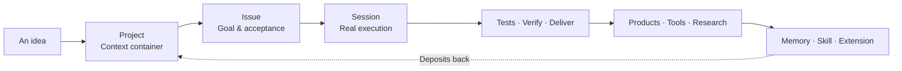

<div align="center">

<picture>
  <source media="(prefers-color-scheme: dark)" srcset="https://img.shields.io/badge/%E2%88%9E-Mobius%20AgenticOS-FFFFFF?style=for-the-badge&labelColor=000000&color=8B5CF6">
  <source media="(prefers-color-scheme: light)" srcset="https://img.shields.io/badge/%E2%88%9E-Mobius%20AgenticOS-FFFFFF?style=for-the-badge&labelColor=1a1a2e&color=8B5CF6">
  
</picture>

# ∞

### A ship of Theseus that continuously reshapes itself around your needs.

**Mobius · AgenticOS** is an enterprise-grade production system for real project collaboration. It puts projects, tasks, execution sessions, context, and run history into a single workstation—where agents don't just answer, they ship, verify, deliver, and iterate inside your code and business environments.

<br/>

<table>
  <tr>
    <td width="33%" align="center" bgcolor="8B5CF6">
      <h3>♾️ &nbsp;Always-On</h3>
      <p>Weeks of continuous operation across multiple parallel projects.</p>
    </td>
    <td width="33%" align="center">
      <h3>🧬 &nbsp;Self-Evolving</h3>
      <p>Three-layer evolution that turns every shipment into system capability.</p>
    </td>
    <td width="33%" align="center">
      <h3>✨ &nbsp;Incubating</h3>
      <p>Real products, research, Skills, Extensions—continuously compounding.</p>
    </td>
  </tr>
</table>

<br/>

[](https://mobius.nutshellai.cn/)
[](./LICENSE)
[](https://github.com/zai-org)
[]()

<br/>

[**Explore the demo →**](https://mobius.nutshellai.cn/) &nbsp;&nbsp;&nbsp; [**Read the docs →**](#documentation)

</div>

<br/>
<hr/>
<br/>

## The Premise

> Most agents stop at the conversation. Mobius reabsorbs code, knowledge, Memory, Skill, Extension, and research outcomes back into system capability. **It builds products for you, and uses those products to rebuild itself.**

```diff
- Perceive → Plan → Execute → Reflect → Task ends → Back to origin
+ Perceive → Plan → Execute → Reflect → Deposits ↻ One layer up
```

<br/>

<div align="center">
  <table>
    <tr>
      <td align="center" width="25%">
        <br/>
        <sub>Workspace &<br/>long-term context</sub>
      </td>
      <td align="center" width="25%">
        <br/>
        <sub>Goal, scope,<br/>acceptance criteria</sub>
      </td>
      <td align="center" width="25%">
        <br/>
        <sub>Real agent run:<br/>model, snapshot, logs</sub>
      </td>
      <td align="center" width="25%">
        <br/>
        <sub>Memory · Skill ·<br/>Extension flow back</sub>
      </td>
    </tr>
  </table>
</div>

<br/>

## What you can do

<table>
  <tr>
    <td width="50%" valign="top">
      <h3>🚀 &nbsp;Solo Dev / One-Person Company</h3>
      <p>Run multiple parallel lines of work. The assistant takes natural-language requests and decomposes them into projects and tasks. Multiple Agent Sessions execute in isolated workspaces; you only confirm at key milestones. With aimux remote compute, agents run on your local hardware—no need to babysit the screen.</p>
    </td>
    <td width="50%" valign="top">
      <h3>🔬 &nbsp;Multi-Agent Research</h3>
      <p>Assemble an agent team: one Chief Researcher plans, multiple assistants run sub-topics in parallel, collaborate asynchronously through a shared blackboard, and aggregate into a visual research graph. Ideal for tech selection, competitive analysis, literature review.</p>
    </td>
  </tr>
  <tr>
    <td colspan="2" valign="top">
      <h3>⚡ &nbsp;Fast Product Development</h3>
      <p>From requirement to runnable product, entirely in the Web UI. Bundled product examples built using Mobius itself:</p>
      <p>
        
        
        
        
      </p>
      <p>Extensions ship standalone apps with UI and backend logic without modifying the main code.</p>
    </td>
  </tr>
</table>

<br/>

## Seven Capabilities

<table>
  <tr>
    <td width="50%" valign="top">
      <h4>01 · Always-On</h4>
      <p>Multi-project, day-and-night progress. Stall detection + whipping mechanism. Inspect, supplement, take over, accept anytime.</p>
    </td>
    <td width="50%" valign="top">
      <h4>02 · Self-Evolving</h4>
      <p>Three layers: user-driven, information-driven, cognitive-driven. Mobius itself lives as project <code>imac-self-develop</code>.</p>
    </td>
  </tr>
  <tr>
    <td width="50%" valign="top">
      <h4>03 · Team Workflow</h4>
      <p>Context auto-injection, structured handoff, parallel isolation, permission and audit.</p>
    </td>
    <td width="50%" valign="top">
      <h4>04 · Multi-Agent</h4>
      <p>tmux-based runtime hosting Codex / Claude Code. Async alignment via shared blackboard.</p>
    </td>
  </tr>
  <tr>
    <td width="50%" valign="top">
      <h4>05 · Compute Fleet</h4>
      <p>aimux node management. Mass data, batch regression, simulation, parallel R&D.</p>
    </td>
    <td width="50%" valign="top">
      <h4>06 · Human-Friendly</h4>
      <p>XiaoMo reads the current page, Project, Issue, Session. Proposes candidates before guessing.</p>
    </td>
  </tr>
  <tr>
    <td colspan="2" valign="top">
      <h4>07 · Product Incubation</h4>
      <p>Outputs are real, iterable assets: pages, tools, apps, research graphs, Skills, Memories, Extensions. Independent frontends, isolated backends, unified governance.</p>
    </td>
  </tr>
</table>

<br/>

## Working Model



> [!NOTE]
> Creating a Session freezes Issue + project context + Skill + Memory into a snapshot. Later global changes do not drift existing Sessions.

### Memory · Skill · Research · Extension

- **Memory** — High-frequency, environment-specific, private or volatile info.
- **Skill** — Stable, reusable agent craft.
- **Research** — Parallel to Issue. Chief Researcher / Assistant roles.
- **Extension** — Apps in `mobius/extension/<name>/`. Backend via `/ext` proxy.

<br/>

## Assistant

**XiaoMo** is a global floating assistant. Not a Project or Issue—each user has one persistent user-level Agent Session.

- Reads current route, Project, Issue, Session, and visible page contents.
- Searches user-visible Projects and Issues.
- Creates Project / Issue / Session when info is sufficient.
- Provides 2–4 clickable candidates for ambiguous requests.
- "Self-shaping" mode: creates improvement Issues inside the self-evolution project.

> [!CAUTION]
> XiaoMo can create Sessions but will not auto-start business agents. User confirmation required.

<br/>

## Quickstart

### Option A · Container (recommended)

```bash
git clone https://github.com/nutshellai-tech/mobius.git
cd mobius

docker build -t imac-mobius-base:latest -f deploy/Dockerfile .
docker build -t imac-mobius-exe:latest .

docker compose up
```

### Option B · Local development

Requires `tmux`, Node.js `18+`, Python 3, and at least one Agent CLI (Codex or Claude Code).

```bash
git clone https://github.com/nutshellai-tech/mobius.git
cd mobius
cp .env.example .env
```

Bootstrap admin (once):

```bash
cd mobius
IMAC_BOOTSTRAP_USERS="admin:your-password:admin:Administrator" \
  DB_PATH=<data>/mobius.db \
  WORKSPACE_ROOT=<data>/workspace \
  node scripts/bootstrap-users.js
```

Launch:

```bash
cd ..
python3 start.py --detach
```

| Service | URL |
|---|---|
| Frontend | `http://localhost:45616` |
| Backend API | `http://localhost:45614` |
| aimux bridge | `http://localhost:45615` |
| VS Code Web | `http://localhost:45617` |

<br/>

## Documentation

| Doc | What it covers |
|---|---|
| [API Key Setup](docs/zhipu-key-setup.md) | Model endpoint and key configuration |
| [Path Configuration](docs/path.md) | Container paths, data directories, persistence |
| [Extension Design](docs/design-ext.md) | Extension frontend/backend structure and isolation |
| [Endpoint Reference](docs/endpoint.md) | Backend API endpoints |
| [Deployment Notes](deploy/README.md) | Podman Compose and persistent volumes |

<br/>

## Project Layout

```text
mobius/
├── mobius/
│   ├── backend/              # API, Agent backend, routes, services
│   ├── extension/            # Mobius extension apps
│   ├── frontend/             # React / Vite web frontend
│   ├── scripts/              # Bootstrap and maintenance scripts
│   ├── tests/                # Backend and agent tests
│   ├── package.json          # Node.js backend deps
│   └── server.js             # Backend entry
├── deploy/                   # Podman / Compose deployment
├── docs/                     # Design, endpoint, path, ops docs
├── scripts/                  # code-server and migration scripts
├── start.py                  # Local dev launcher
└── Dockerfile
```

<br/>

## Deployment

```bash
# First deploy
git clone -b agent_smart_dev <repo-url> imac
cd imac && cp .env.default deploy/.env
cd deploy && podman compose build && podman compose up

# Update
cd imac && git pull && cp .env.default deploy/.env
cd deploy && podman compose build
podman compose down && podman compose up
```

On container start, `docker-entrypoint.sh` auto-initializes users from `IMAC_BOOTSTRAP_USERS`.

<br/>

## Roadmap

As of 2026-06-08, the README has been updated to reflect the latest implementation:

- ✅ XiaoMo upgraded to a persistent user-level Agent Session with configurable model, Skill, Memory.
- ✅ XiaoMo frontend pushes page state; backend handles search / create / clarify.
- ✅ XiaoMo self-shaping entry creates Issues inside the self-evolution project.
- ✅ Tour system expanded into three routes with state models and segmented logic.
- ✅ Cross-route segmentation, form prefill, snapshot explanation, Session advance, cleanup.
- ⚠️ Only Birthday Demo auto-triggers; other two routes need explicit UI entry.
- 🔜 Research, extensions, and special apps to be reflected in the overview.

<br/>

## License

> [!IMPORTANT]
> Mobius uses a custom **Source-Available license**. Source code may be used for learning, research, education, personal projects, and internal evaluation; commercial use requires separate authorization. See [LICENSE](LICENSE).

Commercial licensing: `business@nutshellai.cn`

<br/>

<div align="center">
  <hr/>
  <br/>
  <h3>∞</h3>
  <p><strong>What you see is what you get.<br/>What you imagine can grow.</strong></p>
  <br/>
  <a href="https://mobius.nutshellai.cn/"></a>
  <br/><br/>
</div>
