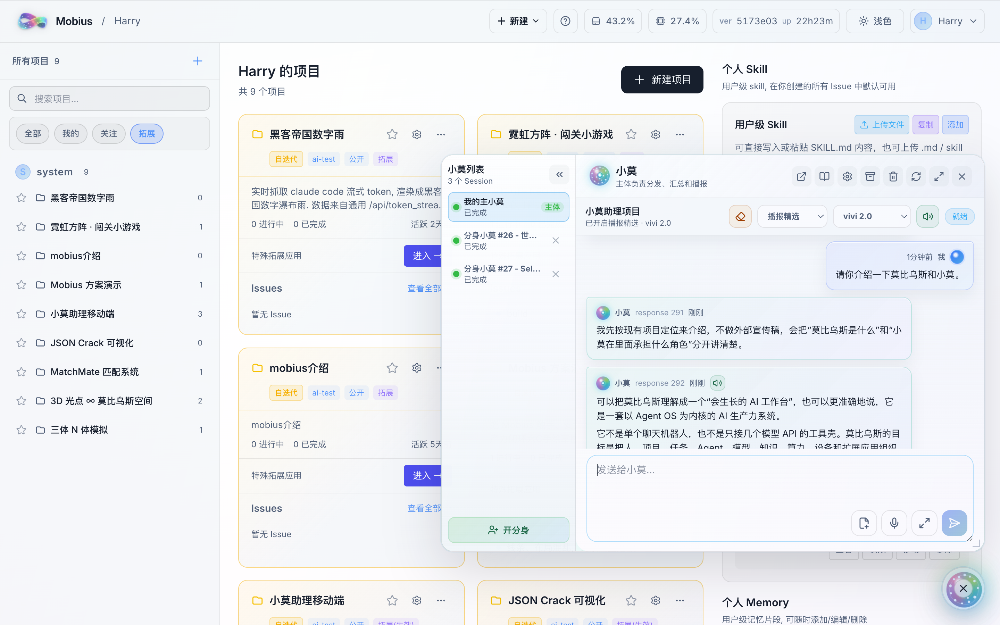

<p align="center">
  
</p>

<h1 align="center">莫比乌斯</h1>

<p align="center">
  <strong>开源的自进化生产力系统</strong><br />
  <strong>人机物智算协同的超级智能体系统</strong>
</p>

<p align="center">
  <a href="https://github.com/nutshellai-tech/mobius"></a>
  <a href="https://github.com/nutshellai-tech/mobius/blob/main/LICENSE"></a>
  <a href="https://github.com/nutshellai-tech/mobius/stargazers"></a>
  <a href="https://github.com/nutshellai-tech/mobius/forks"></a>
  <a href="https://github.com/nutshellai-tech/mobius"></a>
  <a href="https://mobius.nutshellai.cn/"></a>
</p>

<p align="center">
  <a href="https://mobius.nutshellai.cn/"><strong>官网网站</strong></a>
  ·
  <a href="./README.md"><strong>简体中文</strong></a>
  ·
  <a href="./README.en.md"><strong>English</strong></a>
  ·
  <a href="https://nutshellai-tech.github.io/mobius/"><strong>使用文档</strong></a>
  ·
  <a href="https://github.com/nutshellai-tech/mobius/blob/main/README.zh.md"><strong>我们想说的</strong></a>
</p>

<p align="center">
  
</p>

## 基本介绍

Mobius 是据我们所知全球首个自进化的开源智能体操作系统：一个能够按照个性化需求持续自我迭代的 AI 工作台。它不是固定形态的工具箱，而是一个会生长、会进化的生产力系统；你可以基于 Mobius 构建属于自己的 Agent OS，把项目、团队、模型、知识、设备、算力和业务应用组织成同一个可追踪的工作面。

利用 Mobius，仅通过一句话，就可以将你的一切通过莫比乌斯联系并“AI 起来”。这个“一切”包括你和你的团队、你的专属智能体、你的移动终端设备、你的远程算力平台，甚至是你的硬件机器人。你有什么，都可以加到莫比乌斯中。

同时，Mobius 也不是只给专业开发者使用的复杂系统。智能小莫把底层 Project、Issue、Session、Agent、Skill、Memory 等结构收束成自然语言入口：不懂 AI 的人也可以直接说目标，让小莫创建任务、调度 Agent、跟踪进度、汇总结论，甚至把一次需求沉淀成新的插件、工作流或产品能力。

---

## 为什么使用莫比乌斯？

**试图打造一劳永逸的完美 AI Harness 系统，就如试图寻找莫比乌斯环的尽头一样，终究徒劳无功。**

现有很多 Agent 框架仍然停留在“调用模型”和“编排流程”的层面：它们可以完成一次任务，却很难把每一次真实使用沉淀为系统能力；它们可以接入工具，却常常缺少项目、团队、设备、算力和知识资产之间的统一任务面；它们能让 Agent 工作，却未必能让人真正掌控 Agent 编队。

Mobius 正是为了解决这些问题而诞生。它把 Agent OS、项目系统、任务系统、模型引擎、扩展应用和自我迭代机制放在一起，让 AI 不只是回答问题，而是持续参与真实生产、持续吸收反馈、持续进化为更适合你和团队的系统。

### 1. **会生长、可进化**

莫比乌斯可以根据用户需求不断修改自身，也可以自动追踪最前沿技术，根据用户偏好进行自我迭代。你提出一个改动、给一张截图、发一个参考链接，它都可以转化为真实的代码、界面、插件或工作流更新。

### 2. **人-机-物-智-算协同**

莫比乌斯用 Agent OS 作为内核，把五个要素组织进同一系统：人提出目标和判断；机承载开发、调试和部署；物负责物理世界的观测与执行；智组织任务和执行；算提供计算资源。五者在莫比乌斯中形成可追踪、可复盘、可持续成长的协同关系。

### 3. **智能小莫，方便易用**

莫比乌斯的智能小莫，将复杂的超级 Agent 系统收束成一个小学生也能使用的自然语言入口。用户只需要跟小莫聊天，就能调用各类资源完成复杂任务：创建项目、拆解任务、启动 Agent、查询进度、总结结果、提醒关键事项。

---

## 其他亮点

### 4. **人与多 Agent 协作**

莫比乌斯可以自动将复杂任务拆解，动态分派给多个 Agent。多个 Agent 可以围绕同一个目标异步协作，分别承担调研、开发、测试、设计、文档、审查等角色，稳步推进任务直至完成。所有 Agent 的活动均可实时追踪和干预。

### 5. **人类团队协作支持**

莫比乌斯把人类成员、AI Agent、项目任务和交付结果放进同一个协作视图。团队负责人可以看到谁在做什么、Agent 进展到哪里、哪些结果等待确认、哪里存在风险，从而减少反复追问、手动同步和碎片化沟通。

### 6. **任意 AI 模型兼容**

莫比乌斯不押注单一模型，也不只是简单接入 API。GPT、Claude、GLM、Codex 以及未来更多模型，都可以作为不同 Agent 的执行引擎进入项目、任务、上下文和交付流程，让用户按任务类型、成本、性能和部署环境灵活选择。

### 7. **自孵化拓展**

莫比乌斯既带有内置拓展应用，也可以根据用户需求孵化新的 App。金融新闻墙、PPT 生成器、科研工作台、世界杯专题页、团队内部工具，都可以通过扩展系统生成前端、后端 handler、数据目录和调用入口，并继续被使用、迭代和组合。

---

## 使用莫比乌斯可以做什么？

### 1. 搭建自己的 Agent OS

把模型、Agent、Skill、Memory、项目、设备和算力统一接入 Mobius，形成属于你自己的 AI 工作台。它不是一个一次性聊天窗口，而是可以持续运行、持续迭代、持续沉淀经验的生产系统。

### 2. 团队开发与项目管理

用自然语言创建项目、拆任务、分配 Agent、跟踪状态、检查风险和汇总结果。开发者可以让 Agent 修 bug、做前端、写后端、跑测试；负责人可以查看项目进展、交付质量和协作记录。

### 3. 快速生成 Demo 与业务应用

你可以让小莫直接创建一个插件、一个网页、一个专题站、一个内部工具或一个数据看板。Mobius 会把需求拆成代码、资源、后端接口和运行入口，最终沉淀为可以继续使用的扩展应用。

### 4. 深度科研与 Auto Research

Mobius 可以把论文阅读、资料调研、实验复现、代码检查、结果总结和价值判断组织成可追踪的研究流程。研究目标不再只是一次问答，而可以展开成一支 Agent 研究组和一条可复盘的科研流水线。

### 5. 连接真实设备与算力

Mobius 可以把本地机器、远程服务器、GPU 集群、移动终端，甚至传感器和机器人纳入同一任务系统。用户提出目标，系统负责组织真正能执行任务的环境与资源。

---

## 快速开始

详细部署说明请参考 [使用文档](https://nutshellai-tech.github.io/mobius/) 和 [原仓库 README](https://github.com/nutshellai-tech/mobius/blob/main/README.zh.md)。下面保留最常用的两种启动方式。

### 方式一：容器中安装和运行（推荐）

```bash
# 1. 克隆仓库
git clone https://github.com/nutshellai-tech/mobius.git
cd mobius

# 2. 生成配置
python3 conf_prepare.py --docker && python3 conf_check.py --docker

# 3. 构建镜像
docker build -t mobius-system-base:latest -f deploy/Dockerfile .
docker build -t mobius-system-exe:latest .

# 4. 启动
docker compose up
```

### 方式二：直接部署（Linux / macOS）

```bash
# 1. 安装必要依赖
sudo apt install tmux python3 git curl proxychains openssh-server build-essential

# 2. 安装 Agent 执行引擎
npm install -g @anthropic-ai/claude-code @openai/codex

# 3. 克隆仓库
git clone https://github.com/nutshellai-tech/mobius.git
cd mobius

# 4. 生成并检查配置
python3 conf_prepare.py && python3 conf_check.py

# 5. 安装前后端依赖
cd ./mobius && npm install
cd ./frontend && npm install
cd ../..

# 6. 运行
python3 start.py
```

---

## RoadMap 和 Contribution

### RoadMap

- **v0.1 - Agent OS 基础工作台**：项目、Issue、Session、模型接入、Agent 执行与基础任务管理。
- **v0.2 - 智能小莫与多 Agent 协作**：自然语言入口、任务拆解、分身协作、进度汇总和关键结果提醒。
- **v0.3 - 自进化与扩展系统**：插件孵化、前后端扩展、项目知识沉淀、使用反馈驱动系统迭代。
- **v0.4 - 团队协作与管理视图**：多人项目、权限、任务状态、Agent 贡献追踪、团队 AI 使用分析。
- **v0.5 - 人机物智算协同**：远程算力、设备接入、机器人/终端联动、科研与工程任务流水线。

### Contribution

Mobius 仍在快速生长。我们欢迎开发者、研究者、设计师、产品负责人和真实用户一起参与：提交 Issue、提出需求、贡献插件、改进文档、报告 bug、分享使用案例，或者直接帮助 Mobius 进化它自己。

当前主要贡献者与维护身份包括：

- Nutshell.AI / 果壳智算团队
- NutyHenry
- Mobius OS contributors

如果你认同“AI 系统不应该只是预制工具，而应该成为可持续进化的生产力系统”，欢迎加入 Mobius 的构建。

<p align="center">
  <a href="https://github.com/nutshellai-tech/mobius">GitHub</a>
  ·
  <a href="https://mobius.nutshellai.cn/">Website</a>
  ·
  <a href="https://nutshellai-tech.github.io/mobius/">Docs</a>
</p>
